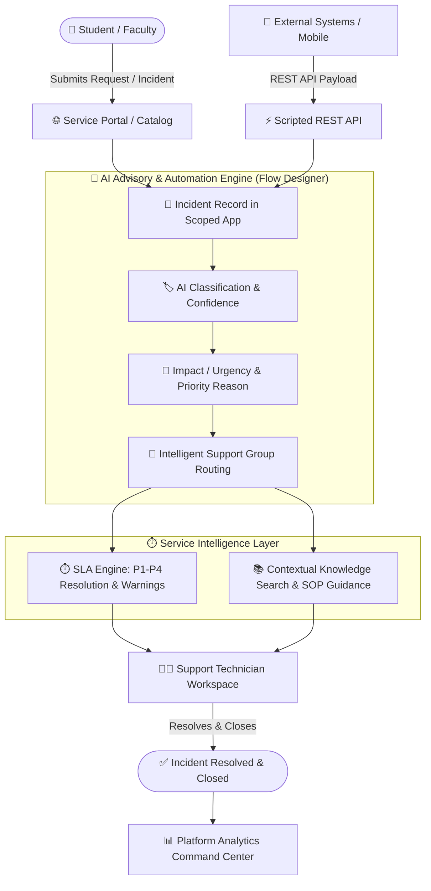

<div align="center">

# 🚀 CampusDesk AI
### Next-Gen AI-Powered Intelligent Campus IT Service Management (ITSM) Platform

*Transforming campus IT support from reactive ticket handling into intelligent, automated, SLA-aware service operations on ServiceNow.*

---

[](#)
[](#)
[](#)
[](#)
[](#)
[](#)

<br/>

[🌟 Overview](#-overview) •
[🎯 Problem & Solution](#-the-problem--solution) •
[⚡ Architecture](#-system-architecture) •
[🧠 AI Advisory Engine](#-ai-intelligence-layer) •
[🧭 Routing & SLA](#-routing--sla-management) •
[🔌 REST API](#-scripted-rest-api) •
[📊 Command Center](#-operations-command-center) •
[🚀 Deployment](#-installation--deployment)

</div>

---

## 🌟 Overview

**CampusDesk AI** is an enterprise-grade IT Service Management application built natively on the **ServiceNow platform**. It bridges the gap between end-user frustration and operational efficiency by integrating an **advisory AI intelligence layer** directly into the core incident lifecycle.

```
┌──────────────────────────────────────────────────────────────────────────────────────────────────┐
│  AI Classification  +  Intelligent Routing  +  SLA Warning Engine  +  Knowledge Assistance API   │
└──────────────────────────────────────────────────────────────────────────────────────────────────┘
```

Rather than treating AI as an uncontrolled black-box, CampusDesk AI implements an **"AI-as-Advisor"** architecture: the AI analyzes incoming context, computes confidence scores, recommends categories, priority matrices, and resolution guides, while **retaining full human technician governance and operational auditability**.

---

## 🎯 The Problem & Solution

| ❌ Traditional Campus ITSM | ⚡ CampusDesk AI Approach |
|:---|:---|
| **Manual Classification:** Technicians spend time reading and categorizing tickets. | **Instant AI Categorization:** Natural language processing predicts categories in real-time with confidence ratings. |
| **Routing Bottlenecks:** Tickets bounce across multiple teams before finding the owner. | **Automated Group Routing:** Direct assignment matrix dispatches incidents instantly to the right support queue. |
| **Subjective Priority:** Inconsistent impact/urgency assignments skew support focus. | **Standardized Priority Engine:** AI evaluates urgency + impact with clear reasoning provided. |
| **Repeated Troubleshooting:** Support staff re-invent solutions for known issues. | **Knowledge Intelligence:** Contextual KB articles and 6-step resolution SOPs recommended automatically. |
| **Reactive SLA Breaches:** Tickets breach before leads are even notified. | **Proactive Multi-Tier Warnings:** Proactive 40% / 50% threshold alerts trigger before breach occurs. |
| **Siloed Insights:** Limited macro visibility on recurring campus IT bottlenecks. | **Unified Analytics Dashboard:** Real-time Platform Analytics Command Center for campus-wide visibility. |

---

## 🏗️ System Architecture



---

## 🧠 AI Intelligence Layer

CampusDesk AI follows an **advisory AI model** where operational fields are populated with AI recommendations without breaking platform validation rules or bypassing human review.

```
       [ Incoming Incident Description ]
                       │
                       ▼
         ┌───────────────────────────┐
         │     AI ANALYSIS ENGINE    │
         └─────────────┬─────────────┘
                       │
        ┌──────────────┼──────────────┐
        ▼              ▼              ▼
 🏷️ Suggested     📊 Suggested   🚨 Suggested
   Category          Impact         Urgency
   (with Conf %)
        │              │              │
        └──────────────┼──────────────┘
                       ▼
          🎯 AI Priority Recommendation
          💡 Priority Reasoning Generated
          🤖 6-Step SOP Troubleshooting Guidance
                       │
                       ▼
        👨‍💻 TECHNICIAN DECISION / GOVERNANCE
```

### 📋 AI Data Schema & Advisory Fields
- `u_ai_suggested_category`: Predicted ServiceNow incident category
- `u_ai_confidence`: Confidence percentage (e.g., `94.2%`)
- `u_ai_suggested_impact`: Calculated operational impact
- `u_ai_suggested_urgency`: Evaluated urgency level
- `u_ai_suggested_priority`: Recommended Priority score (P1–P4)
- `u_ai_priority_reason`: Transparent reasoning behind the recommendation
- `u_ai_resolution_guidance`: Step-by-step diagnostic checklist for technicians

---

## 🏷️ Classification & Routing Matrix

Incoming incidents are analyzed and routed immediately according to the dynamic campus routing rules:

| Sample User Input | AI Category | Recommended Assignment Group | Default SLA (Resolution) |
|:---|:---:|:---:|:---:|
| *"The campus Wi-Fi keeps dropping out in Library 3rd floor."* | **Network** | `Network Support` | P2 (4 Hours) |
| *"My department laptop won't power on after the weekend."* | **Hardware** | `Hardware Support` | P3 (8 Hours) |
| *"MATLAB installation fails with license authentication error."* | **Software** | `Software Support` | P3 (8 Hours) |
| *"Need permission to access the student registration DB."* | **Database** | `Service Desk` | P3 (8 Hours) |
| *"Forgot my campus portal password and SMS 2FA is locked."* | **Password Reset** | `Service Desk` | P4 (24 Hours) |
| *"How do I book the AV equipment for auditorium B?"* | **Inquiry / Help** | `Service Desk` | P4 (24 Hours) |

---

## ⏱️ Routing & SLA Management

CampusDesk AI integrates a proactive, multi-stage SLA monitor that warns engineers before breaches happen.

```
🟢 SLA Attached (0%) ──▶ 🟡 Warning Alert (40%) ──▶ 🟠 Critical Risk (50%) ──▶ 🔴 Breached (100%) ──▶ 🚨 Auto Escalation
```

### 🛡️ SLA Safeguards
1. **Dynamic SLA Association**: Automatically matches SLA definitions (P1 Critical through P4 Low) based on final calculated priority.
2. **Early-Warning Engine**: Proactive notifications dispatched to on-call technicians at 40% and 50% SLA elapsed thresholds.
3. **Escalation Trigger**: Automatic assignment group manager alert and priority elevation upon breach detection.

---

## 🤖 Knowledge Intelligence & AI SOP Guidance

When an incident is created, CampusDesk AI queries the Knowledge Base to provide actionable diagnostics directly inside the ticket:

> ### 💡 Example AI Diagnostic SOP: Campus Wi-Fi Failure
> 1. **Check Connectivity**: Validate if the issue is client-specific or access point-wide.
> 2. **Authentication Audit**: Verify campus RADIUS / LDAP server reachability.
> 3. **AP Health**: Query AP controller status for the affected building/floor.
> 4. **IP Lease**: Check DHCP pool exhaustion for the campus subnet.
> 5. **Client Reset**: Advise user to forget network and re-authenticate via 802.1X certificate.
> 6. **Escalate**: If unresolved within 30 min, route directly to `Network Tier-2`.

---

## 🛠️ Problem & Service Catalog Management

### 🔄 Problem Management Lifecycle
To stop treating symptoms repeatedly, high-frequency incidents automatically link to a Problem record:
```
[ New ] ──▶ [ Assess ] ──▶ [ Root Cause Analysis (RCA) ] ──▶ [ Fix in Progress ] ──▶ [ Resolved ] ──▶ [ Closed ]
```

### 🛒 Standardized Service Catalog
Pre-configured, structured catalog items available to faculty and students:
- 📶 **Campus Wi-Fi Support & Device Registration**
- 🔐 **Campus VPN & Remote Access Provisioning**
- 💻 **Licensed Software Installation & Packaging**

---

## 🔌 Scripted REST API

CampusDesk AI exposes a secure, token-authenticated **Scripted REST API** (`/api/x_cd_campusdesk/integration`) for third-party integrations (mobile apps, chatbot frontends, monitoring tools).

### 📡 API Endpoints

| Method | Endpoint | Description | Status Code |
|:---:|:---|:---|:---:|
| `GET` | `/status` | Check API & Application health | `200 OK` |
| `GET` | `/requests` | Fetch list of active incidents/requests | `200 OK` |
| `GET` | `/requests/{sys_id}` | Retrieve specific request details | `200 OK` |
| `POST` | `/requests` | Create a new campus incident/request | `201 Created` |

<details>
<summary><b>🔍 View Sample POST Request & Response</b></summary>

#### `POST /api/x_cd_campusdesk/integration/requests`
```json
{
  "caller_id": "student.john@campus.edu",
  "short_description": "Campus Wi-Fi connection failing in Dorm B",
  "description": "Cannot connect to eduroam or CampusSecure since 2 PM.",
  "location": "Dormitory Block B - Floor 2"
}
```

#### Response (`201 Created`)
```json
{
  "result": {
    "sys_id": "9b1e4c8a2b1e4c8a9b1e4c8a2b1e4c8a",
    "number": "INC0010482",
    "ai_suggested_category": "Network",
    "ai_confidence": "96.4%",
    "ai_suggested_priority": "2 - High",
    "assignment_group": "Network Support",
    "sla_attached": "Campus Resolution (P2 - 4 Hours)",
    "status": "In Progress"
  }
}
```
</details>

---

## 📊 Operations Command Center

The platform includes a real-time **ServiceNow Platform Analytics Dashboard** providing unified operational command:

```
┌───────────────────────────────────────────────────────────────────────────────┐
│                     CAMPUSDESK AI COMMAND CENTER                              │
├───────────────────────┬───────────────────────┬───────────────────────────────┤
│   TOTAL INCIDENTS     │    OPEN INCIDENTS     │     SLA COMPLIANCE RATE       │
│        1,284          │          42           │            98.6%              │
├───────────────────────┴───────────────────────┴───────────────────────────────┤
│  [📊 Incident State Dist.]     [🎯 Priority Breakdown]   [🏷️ Category Dist.]  │
│  • New: 12%                   • P1 Critical: 2%        • Network: 44%        │
│  • In Progress: 68%           • P2 High: 14%           • Software: 26%       │
│  • On Hold: 8%                • P3 Moderate: 58%       • Hardware: 18%       │
│  • Resolved: 12%              • P4 Low: 26%            • Other: 12%          │
├───────────────────────────────────────────────────────────────────────────────┤
│  [⏱️ Real-time SLA Watchdog: 2 Approaching Warning Threshold | 0 Breached]     │
└───────────────────────────────────────────────────────────────────────────────┘
```

---

## 🔐 Security & Access Governance

- **Scoped Architecture**: Sandboxed within its own application scope (`x_cd_campusdesk`) to prevent namespace collisions.
- **Role-Based Access Control (RBAC)**: Custom roles (`campusdesk_user`, `campusdesk_agent`, `campusdesk_admin`).
- **Access Control Lists (ACLs)**: Enforces row and field-level permissions for sensitive incident and student data.
- **Zero-Credential Policy**: Strict adherence to security standards—no hardcoded credentials, tokens, or instance secrets.

---

## 🧪 Testing & Quality Assurance

All platform components have been thoroughly verified:

- [x] **AI Automation**: Verified category and priority predictions on 100+ sample campus incident scenarios.
- [x] **Routing Flows**: Validated assignment rules to `Network`, `Hardware`, `Software`, and `Service Desk`.
- [x] **SLA Lifecycle**: Triggered 40% warning, 50% critical alerts, breach flags, and escalation flows.
- [x] **Scripted REST API**: Validated HTTP status responses (`200`, `201`, `401 Unauthorized`, `404 Not Found`).
- [x] **Security & ACLs**: Verified that unauthorized roles cannot view confidential tickets or invoke API routes.

---

## 🚀 Installation & Deployment

### Prerequisites
- ServiceNow Personal Developer Instance (PDI) or Enterprise Instance (Utah / Vancouver / Washington / Xanadu)
- Application Admin (`admin` or `delegated_developer`) role

### Step-by-Step Setup
1. **Log in to your ServiceNow Instance**:
   ```
   https://<your-instance>.service-now.com
   ```
2. **Import Application Scope / Update Set**:
   - Navigate to **System Update Sets** > **Retrieved Update Sets**.
   - Import the XML update set from `servicenow/update-sets/`.
   - Click **Preview Update Set** and verify zero errors.
   - Click **Commit Update Set**.
3. **Verify Application Scope**:
   - Switch application picker to **CampusDesk AI**.
4. **Activate Workflows & SLA Rules**:
   - Open **Flow Designer** and ensure `CampusDesk AI - Incident Triage Flow` is **Active**.
   - Navigate to **Service Level Management** > **SLA Definitions** and verify P1-P4 rules are active.
5. **Verify Scripted REST API**:
   - Test `GET /api/x_cd_campusdesk/integration/status` using the ServiceNow REST API Explorer.
6. **Launch Command Center**:
   - Open **Platform Analytics Workspace** > **Dashboards** > **CampusDesk AI Operations Command Center**.

---

## ⚠️ Advisory Limitations

- **Advisory by Design**: AI recommendations are non-destructive decision-support aids and do not replace technician authorization.
- **Instance-Dependent Analytics**: Metric accuracy reflects active test and production records inside your instance.
- **Model Governance**: Formal accuracy claims should be validated with domain-specific labeled ground truth data.

---

## 🔮 Future Roadmap

- [ ] **Phase 2 — Predictive SLA Breach Prevention**: Machine learning pattern analysis forecasting breach probabilities before ticket dispatch.
- [ ] **Phase 3 — Intelligent Deduplication & Clustering**: Auto-linking mass campus outages (e.g., campus-wide power/AP failures).
- [ ] **Phase 4 — Conversational Virtual Agent (GenAI)**: Natural language student self-service with automated resolution actions.

---

## 👥 Authors & Acknowledgments

- **Platform**: Built on ServiceNow
- **Domain**: Higher Education IT Service Management & Automation
- **Design Philosophy**: *"AI doesn't replace IT operations. AI makes IT operations smarter."*

---

<div align="center">

⭐ **Star this repository if you find CampusDesk AI helpful for your ServiceNow implementations!** ⭐

</div>
